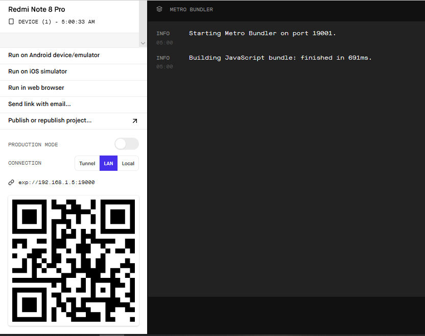

# Bài tập tuần 2 - Lê Thị Thùy Linh

Chạy chương trình:

	*cd hello

	npm start*

> Một trang mới sẽ xuất hiện trên trình duyệt.

> Trên trang này chọn 'run in web browser'. Một trang khác sẽ được mở ra, đây là trương trình sau khi chạy.
Nếu muốn kiểm tra trên điện thoại (Android) thì lên Ch Play tải Expo, sau đó quét mã ở trang web trên.

> Chương trình sau khi chạy (trên điện thoại)

