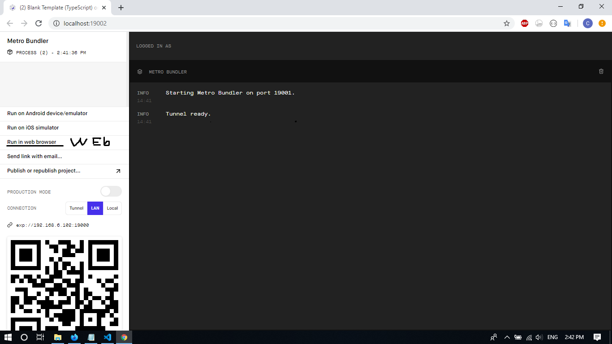

# Bài tập tuần 2 Nguyễn Duy Chiến
Clone reactnative về chạy chương trình đầu tiên Helloworld. 
Chạy chương trình:

```sh
$ cd Eng
$ npm install 
$ npm start
```
Một trang mới xuất hiện trên trình duyệt chọn `run in web browser`
Nếu muốn chạy trên di động cần tải ứng dụng `Expo` trên `Ch Play` Quét phần mã QR xuất hiện trên trang web vừa rồi 
Hình ảnh minh họa: 
